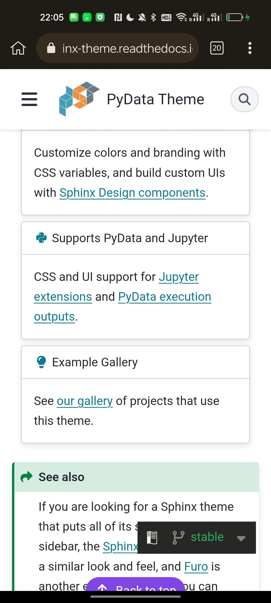

# Contribution #2411: Back to top button is cropped on mobile

**Contribution Number:** 2  
**Student:** Yuan Yuan  
**Issue:** https://github.com/pydata/pydata-sphinx-theme/issues/2411  
**Status:** Phase II Complete

---

## Why I Chose This Issue

I chose this issue — a cropped "back to top" button on mobile in pydata-sphinx-theme — because it's small, clearly defined, and has an obvious "done" state, which makes it a realistic first open-source contribution rather than something that could balloon in scope. My background is mostly in Python, so this front-end bug stretches me in a useful direction: I'll need to dig into the theme's CSS and mobile breakpoints, which complements my existing skills instead of repeating them. Just as importantly, I want to learn the full contribution workflow end-to-end — setting up the project locally, reproducing a bug, opening a focused PR with before/after screenshots, and responding to maintainer feedback — in a mature, newcomer-friendly project. My real goal this cycle isn't just closing one issue, but getting comfortable enough with the process that a bigger one feels routine next time.

---

## Understanding the Issue

### Problem Description
On mobile browsers, the floating "Back to top" button is cut off at the bottom edge of the screen. On Firefox for Android with three-button navigation, part of the button is hidden behind the system navigation bar, and it also flickers (rapidly toggles between shown and hidden) while scrolling. The problem does not appear with gesture-based navigation, and does not appear on desktop.

### Expected Behavior
The button should sit fully within the visible viewport, a fixed distance above the bottom edge, and stay stable (no flickering) while the user scrolls — regardless of the browser's dynamic UI such as the address bar or the system navigation bar.

### Current Behavior
The button is anchored using `top: 90vh`, which places it at 90% of the *largest* viewport height. On mobile, where the system navigation bar reduces the actually-visible height, this pushes the button partly below the visible area, so it appears cropped. Separately, the scroll handler decides visibility with a two-way (show / hide) comparison, which causes flickering on Firefox/Android.

### Affected Components
- `src/pydata_sphinx_theme/assets/styles/base/_base.scss` — the `#pst-back-to-top` rule (controls positioning; cause of the cropping).
- `src/pydata_sphinx_theme/assets/scripts/bootstrap.js` — the scroll-based show/hide handler (cause of the flickering).

---

## Reproduction Process

### Environment Setup
I reused the GitHub Codespaces dev container from my first contribution, which surfaced two real setup issues worth documenting:

- **Python version mismatch.** The container had been built from an older config pinned to Python 3.10, but the project now requires `sphinx>=8.2`, which needs Python >=3.11. Running `tox -e docs-live` failed with `ERROR: No matching distribution found for sphinx<10,>=8.2`. I confirmed the cause with `python --version` (3.10.18) and by checking `.devcontainer/devcontainer.json`, which pins the `mcr.microsoft.com/devcontainers/python:1-3.11-bullseye` image. I fixed it by rebuilding the container (Command Palette → "Codespaces: Rebuild Container"); afterward `python --version` reported 3.11 and the docs built successfully.
- **Wrong build tool assumption.** I first tried `nox -s docs-live`, which failed with `FileNotFoundError: noxfile.py`. The project uses **tox**, not nox; the correct command is `tox -e docs-live` (the live-reload docs environment listed by `tox list`).

Working branch: https://github.com/yyccPhil/pydata-sphinx-theme/tree/fix-issue-2411

### Steps to Reproduce
1. Build and serve the docs locally with `tox -e docs-live`, then open the served site in a browser.
2. Open the browser DevTools and toggle the device toolbar (mobile emulation); select a narrow mobile viewport (e.g. Pixel 7).
3. Open any long documentation page and scroll down until the circular "Back to top" arrow button appears in the lower-center of the screen.
4. **Expected:** the button is fully visible, sitting a fixed distance above the bottom edge.
5. **Actual:** the button, anchored at `top: 90vh`, is pushed toward/below the bottom of the visible viewport and appears cropped. Inspecting `#pst-back-to-top` in DevTools and filtering the Styles pane for `bottom` shows "No matching selector or style," confirming the button is positioned only from the top and never anchored to the bottom.

### Reproduction Evidence
- **Branch in fork:** https://github.com/yyccPhil/pydata-sphinx-theme/tree/fix-issue-2411
- **Screenshots:** 
- **My findings:** The cropping is caused by `top: 90vh` in the `#pst-back-to-top` rule (`_base.scss`), which uses dynamic viewport height that includes browser/system UI. Using `git blame` I traced this line to commit `5fc14526` (PR #1616, "fix: allow user to control the back-to-top button presence," 2024-01-18). Running `git tag --contains 5fc14526` shows the line first shipped in **v0.15.2**, not 0.15.4 as stated in the issue — 0.15.4 is simply the release where the reporter happened to notice it. The flickering is separate and lives in the scroll handler in `bootstrap.js`, which toggles visibility with a two-state comparison.

---

## Solution Approach

### Analysis
There are two independent root causes:

1. **Cropping (CSS).** `#pst-back-to-top` is positioned with `position: fixed; top: 90vh;`. The `vh` unit resolves against the *largest* viewport height, which on mobile includes the space taken by the browser address bar and the Android three-button system navigation bar. The actually-visible area is shorter than `100vh`, so `top: 90vh` places the button lower than intended and it gets clipped by the system UI. Gesture navigation has a much thinner system bar, which is why the reporter doesn't see it there.
2. **Flickering (JS).** The scroll handler in `bootstrap.js` shows the button only when the page is scrolling up and hides it otherwise. On Firefox/Android, slow scrolling fires multiple scroll events with the *same* Y coordinate; those "no-movement" events are treated as "not scrolling up," so the button is hidden between every show — producing the flicker.

### Proposed Solution
- **Cropping:** anchor the button from the bottom of the viewport with a fixed offset (`bottom: <fixed rem>`) instead of `top: 90vh`, removing the dependency on dynamic viewport height. Keep horizontal centering.
- **Flickering:** change the scroll handler from a two-way decision to a three-way one (up → show, down → hide, unchanged → do nothing) so repeated same-Y events no longer toggle visibility.

This direction is consistent with the maintainer's own draft PR (#2442), which fixes the cropping with a bottom anchor and attempts the same flicker fix.

### Implementation Plan
Using the UMPIRE framework (adapted):

**Understand:** The floating back-to-top button is cropped on mobile and flickers on Firefox/Android. The cropping comes from anchoring the button with `top: 90vh` (dynamic viewport height that counts system UI); the flicker comes from a two-state scroll handler that hides the button on any non-upward scroll event.

**Match:** The maintainer's draft PR (#2442) confirms the approach: anchor from the bottom instead of the top, and make the scroll handler distinguish "no movement" from "scrolling down." Other fixed/floating elements in the theme use fixed offsets rather than `vh`, which is the pattern to follow.

**Plan:**
1. In `src/pydata_sphinx_theme/assets/styles/base/_base.scss`, replace `top: 90vh;` on `#pst-back-to-top` with a bottom anchor (e.g. `bottom: <fixed rem offset>;`), keeping the horizontal centering. This removes the dependency on dynamic viewport height and fixes the cropping.
2. In `src/pydata_sphinx_theme/assets/scripts/bootstrap.js`, change the scroll handler from a two-way (up → show, otherwise hide) decision to a three-way one (up → show, down → hide, unchanged → no-op) to fix the flicker.
3. Verify the button still behaves correctly when `back_to_top_button` is disabled in config, to avoid regressing #1950 / #2267.

**Implement:** *(Phase III — placeholder.)* Changes will be committed to the working branch: https://github.com/yyccPhil/pydata-sphinx-theme/tree/fix-issue-2411

**Review:** Self-review against `CONTRIBUTING.md` and the project's commit-message conventions (natural-English imperative style, matching recent merged PRs). Keep the diff minimal and focused on the two root causes.

**Evaluate:** Re-run the reproduction steps in mobile emulation and confirm the button is fully visible and stable while scrolling. Check light and dark themes, gesture and button navigation, and that existing behavior (button appears only after scrolling, click returns to top) still works. Run the theme's test suite (`tox -e py311-tests`) to confirm no regressions.

---

## Testing Strategy

### Unit Tests

- [ ] Test case 1: [Description]
- [ ] Test case 2: [Description]
- [ ] Test case 3: [Description]

### Integration Tests

- [ ] Integration scenario 1
- [ ] Integration scenario 2

### Manual Testing

[What you tested manually and results]

---

## Implementation Notes

### Week [X] Progress

[What you built this week, challenges faced, decisions made]

### Week [Y] Progress

[Continue documenting as you work]

### Code Changes

- **Files modified:** [List]
- **Key commits:** [Links to important commits]
- **Approach decisions:** [Why you chose certain approaches]

---

## Pull Request

**PR Link:** [GitHub PR URL when submitted]

**PR Description:** [Draft or final PR description - much of the content above can be adapted]

**Maintainer Feedback:**
- [Date]: [Summary of feedback received]
- [Date]: [How you addressed it]

**Status:** [Awaiting review / Iterating / Approved / Merged]

---

## Learnings & Reflections

### Technical Skills Gained

[What you learned technically]

### Challenges Overcome

[What was hard and how you solved it]

### What I'd Do Differently Next Time

[Reflection on your process]

---

## Resources Used

- [pydata-sphinx-theme contributor guide](https://pydata-sphinx-theme.readthedocs.io/en/stable/community/)
- [Original issue: pydata-sphinx-theme#2411](https://github.com/pydata/pydata-sphinx-theme/issues/2411)
- [Maintainer's draft fix: PR #2442](https://github.com/pydata/pydata-sphinx-theme/pull/2442)
- [Commit that introduced the bug: PR #1616](https://github.com/pydata/pydata-sphinx-theme/pull/1616)
- [MDN — viewport units (`vh`) and mobile browser behavior](https://developer.mozilla.org/en-US/docs/Web/CSS/length#viewport-percentage_lengths)
- [Bootstrap z-index layering reference](https://getbootstrap.com/docs/5.2/layout/z-index/)
